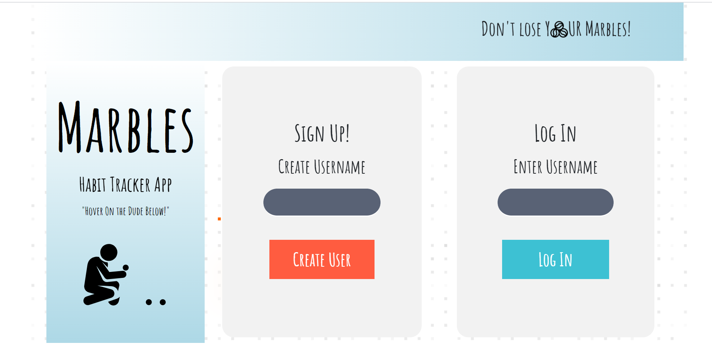

# habit-app
### Project Name :  Habit Tracker
Hanna, Huseyin, Steven, James

### Project Brief / User Stories:
* To build a habit tracker where a user can login, add a habit and how much they would like to track it, and then as the day progresses they can tick it off and their daily progress would accumulate. The data should be persistent so if a user logs off and back in it should be as it were.

* I want to be able to login and logout
* I want to be able to create a habit and the frequency of tracking
* I want to be able to mark things as being done
* I want to be able to delete habits (in case of a typo or I no longer want to track it)
* I want my total progress and habit specific progress shown to me in an easy to understand way

#### Login Page


#### User Profile


---

### To start (instructions on how to initialise App)

In the top level directory run:
```
npm start
```
This should launch your browser with the app (on http://localhost:3000)

* Note if you run into errors on running you may have to install dependencies, to do this run the command below in both the top level and "client" directories
```
npm install
```

The page will reload if you make edits.<br />
You will also see any lint errors in the console.

### Running tests
The command is as below, to run server tests execute this command in top level, to run React (frontend) tests run this in the "client" folder

```
npm test
```
See the section about [running tests](https://facebook.github.io/create-react-app/docs/running-tests) for more information.

---

## Technology
* React
* NodeJS
* Mocha & Chai
* Jest & Enzyme
* Bootstrap

---

## Issues / Solutions
#### Issue 1 
Router tag can only be use once in the App, otherwise the links and routes don't render components correctly
#### Solution to issue 1
BrowserRouter tag needs to wrap the component in wrapper to avoid the error 'Link needs to be in Router'
#### Issue 2
BUG -> when you create a new user and go straight into creating habits and create a habit and press 'ADD' -> it redirects you to Tracker but doesn't map the array of habit for some reason. After you go through the 'login' route it does. 
#### Solution to issue 2
This was fixed by refactoring the code, although now it sometimes requires you to double click checkboxes or delete button
#### Issue 3
passing a parameter AND event in handleChange --> fixed with syntax
#### Issue 4
a 1 character / change delay in handleChange function
#### Solution to issue 4
Using React Hooks.
* Introducting Hooks solved the problem but testing became much harder, we had many nested functions within the functional component and a lot of logic running.

---

## How we would develop our app further

* Implement an authentication system, either using Okta or PassportJS
* Could change the tracking system so that you have 1 checkbox for each habit per day and once complete you check it, if 2 or more days have passed with a certain habit checked then you build a streak. This could be instead of the current tracking system or on top of it.
* Possibly revert back to a class component for the tracking as it contains a lot of data handling and states, would improve test-ability and possibly functionality.

